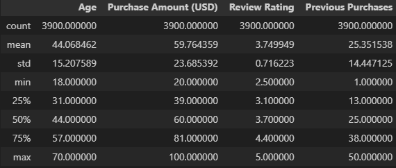
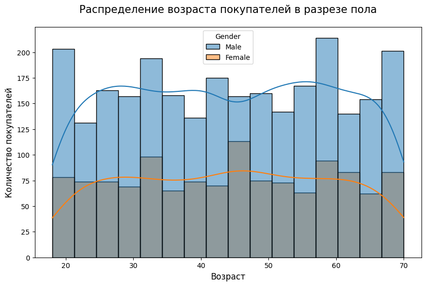
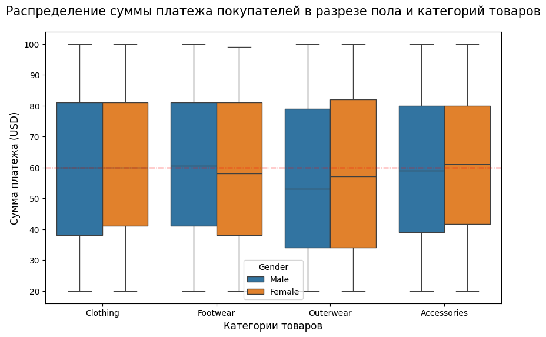
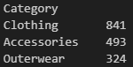
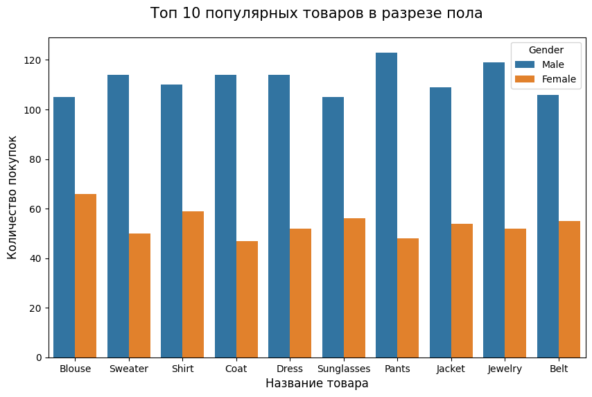
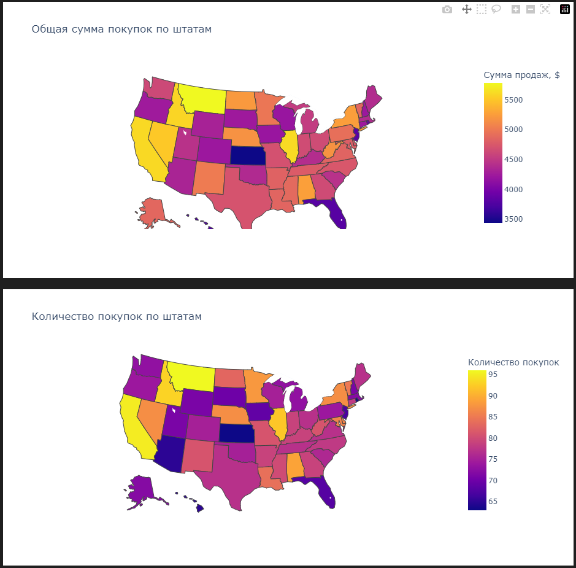
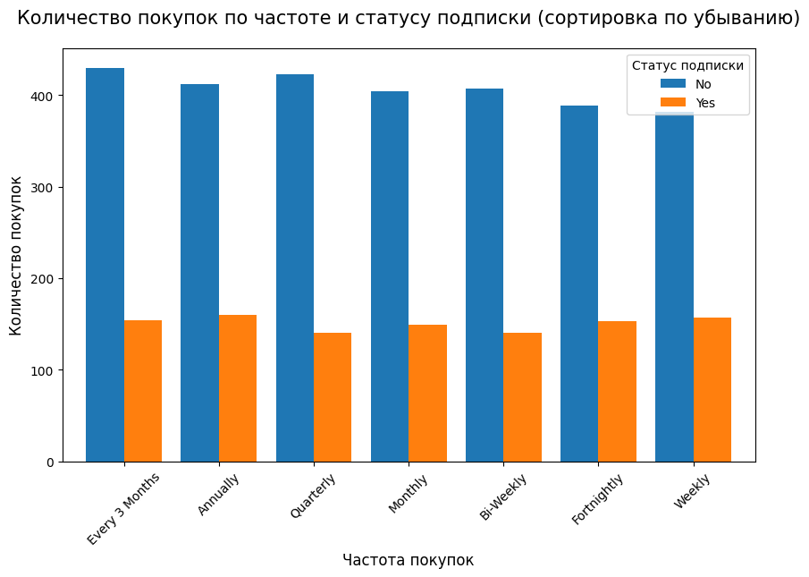
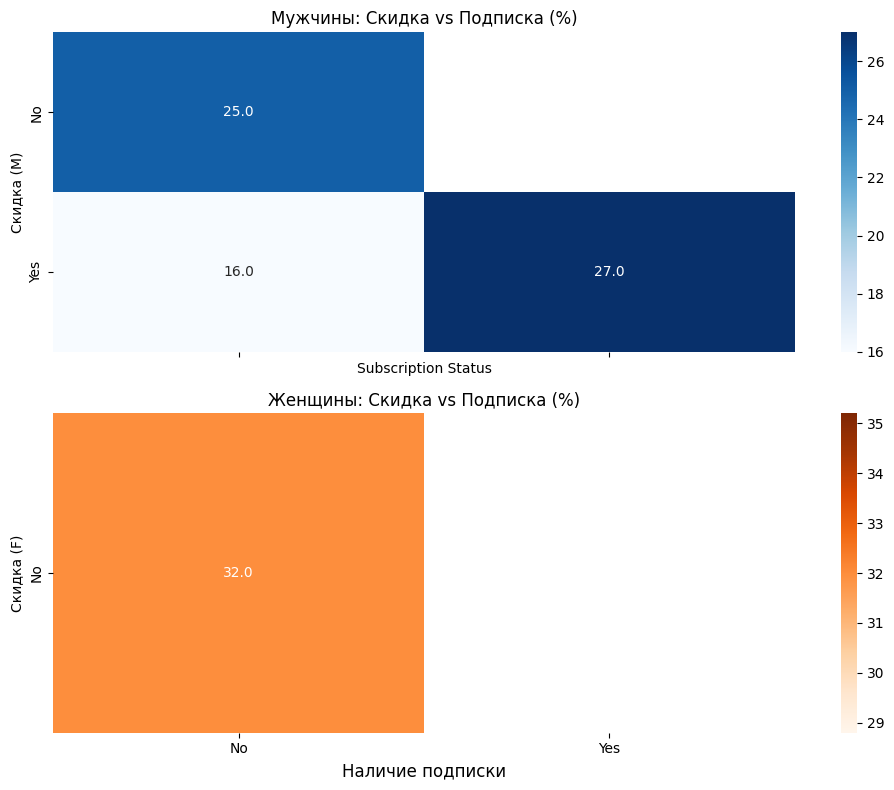
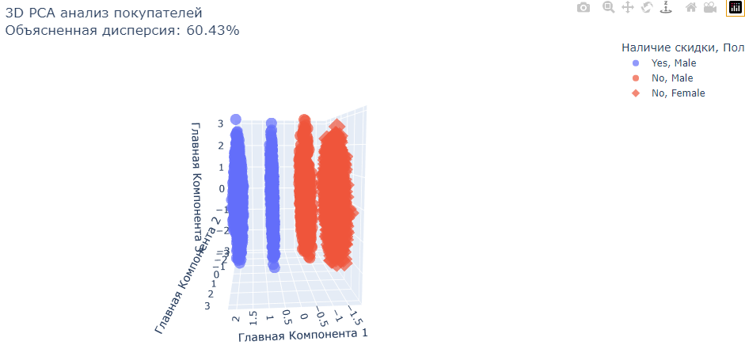
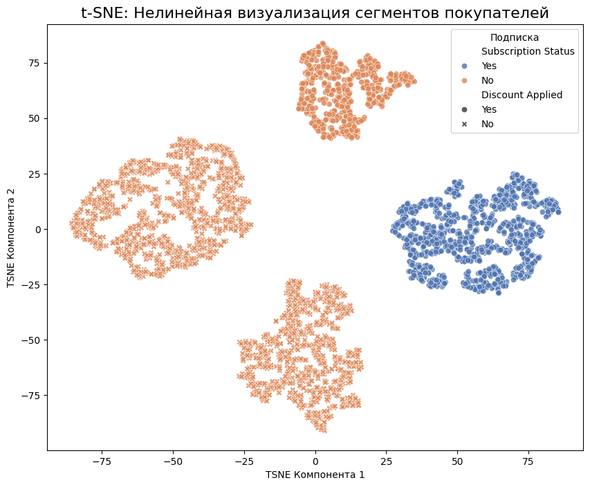

# Study-of-consumer-behavior-patterns-by-methods-of-visualization-and-dimension-reduction
Исследование паттернов покупательского поведения методами визуализации и снижения размерности. Дата сет "Customer Shopping Behaviour Analysis"

**Цель**

- Провести комплексный разведочный анализ данных (EDA) для выявления скрытых закономерностей и аномалий в поведении клиентов.
- Формирование гипотез и визуальный анализ взаимосвязей между характеристиками клиентов и их покупательской активностью.
- Снижение размерности признакового пространства (PCA, t-SNE) для визуализации структуры данных и выявления естественных кластеров потребителей.
- Интерпретация полученных сегментов и описание характерных профилей потребления для каждой группы.
- Разработка бизнес-рекомендаций по оптимизации маркетинговых активностей и программ лояльности на основе выявленных инсайтов.

---
**Данные**

Дата сет "Customer Shopping Behaviour Analysis"

https://www.kaggle.com/datasets/wardabilal/customer-shopping-behaviour-analysis/data

Данный набор данных позволяет получить полное представление о покупательском поведении потребителей в розничной торговле. Он позволяет получить полезные сведения о том, как потребители совершают покупки, тратят деньги и принимают решения, сочетая демографические данные с информацией о покупках.

В набор данных включены такие переменные, как возраст и пол клиента, приобретенные товары, сумма покупки, способы оплаты, использование скидок и частота покупок. Изучение этих характеристик позволяет выявить закономерности в потребительских предпочтениях, моделях расходов и влиянии рекламных акций на покупательское поведение.

Объём 16 столбцов и 3900 строк взаимодействий.

---

**Инструменты**

- Python 
- pandas
- matplotlib
- seaborn
- plotly
- sklearn (StandardScaler, PCA, TSNE)

---
### **Выявленные особенности и гипотезы**

**Вероятно, что данные являются синтетическими**

- слишком «ровные» границы значений (например, ровно от 20 до 100 USD),
- отсутствие выбросов или аномалий, типичных для реальных пользовательских данных,
- искусственное смещение распределений (например, рейтингов).
- Тем не менее, такие данные могут адекватно отражать общие закономерности реального поведения, особенно если использовались качественные методы генерации.

**Покупателями являются преимущественно мужчины — их почти в два раза больше, чем женщин.**

 

У аномалии численного преимущества мужчин может быть несколько причин:
- Специфика ассортимента: магазины специализируются преимусщественно на товарах, востребованных у мужчин.
- Географическое расположение: часть торговых точек может находиться в регионах с высокой концентрацией мужского населения, например, в районах с развитой добывающей или обрабатывающей промышленностью, где широко применяется вахтовый метод работы.
- Близость к промышленным объектам: магазины могут располагаться рядом с крупными заводами, стройками или логистическими центрами, где занято преимущественно мужское население.

**Поведение покупателей чётко отражает стремление к «золотой середине»**

Люди одинаково избегают как слишком дешёвых, так и явно дорогих товаров, предпочитая решения из центрального ценового диапазона.

**Топ 2 категория - украшения**

Возможно, популярные магазины расположены рядом с производственными центрами или имеют выгодные контракты на поставку, что делает эти товары особенно доступными.

**Лидеры продаж для мужчин: брюки, украшения и платья**

Предположим, что украшения и платья это подарки, и у магазина эффективная реклама с акцентом: "Купи в подарок".

**География влияет на продажи**

- Наибольшую выручку приносят штаты Монтана, Калифорния, Айдахо, Иллинойс и Невада. Это может свидетельствовать либо о высокой концентрации целевой аудитории, либо об эффективной логистике и маркетинговой стратегии в этих регионах.
- Особенно выделяется Невада: несмотря на то, что количество продаж здесь на 8 % ниже, чем в других топовых штатах, выручка остаётся одной из самых высоких. Это указывает на то, что в Неваде продаются более дорогие товары — вероятно, продукция премиум-сегмента или с высокой наценкой.
- Аналогичную картину демонстрирует Аризона — штат со средним уровнем доходности, где также наблюдается меньшее количество покупок, но по более высоким ценам.

**Наличие подписки влияет на продажи**

- Покупок, совершённых без подписки, в разы больше, чем с подпиской.
- Структура графика позволяет сделать несколько предположений:
    1. Редкие покупатели, как правило, не оформляют подписку — они взаимодействуют с магазином эпизодически.
    2. Основная клиентская база — это люди, которые редко посещают район расположения магазина.
    3. Учитывая, что топовые регионы по продажам включают туристические и сельские территории, можно предположить, что значительную долю покупателей составляют:
        - Туристы, совершающие разовые покупки,
        - Жители удалённых населённых пунктов, приезжающие в магазин время от времени.
- Такая структура аудитории объясняет низкую проникновение подписки и подчёркивает необходимость гибких моделей лояльности, адаптированных под непостоянное поведение клиентов (например, временные или событийные подписки).

**Данные были выгружены не в полном объёме?**

- Судя по представленным данным, в датасете отсутствуют транзакции женщин с применёными скидками, а также их покупок с наличием подписки. Это вызывает серьёзные вопросы и допускает два основных объяснения:
    1. Магазин чрезвычайно специализирован на мужскую аудиторию. Однако такой сценарий выглядит маловероятным:
        - В ассортименте присутствуют типично женские товары (блузки, платья),
        - А гендерная сегрегация такого масштаба противоречит современным нормам и может нарушать законы о равенстве в потребительской сфере.
    2. Данные неполные или искажены на этапе сбора/выгрузки.
        - На диаграмме «Покупатели всего в разрезе пола» видно, что доля женщин составляет примерно четверть от общего числа покупателей,
        - При этом демографические данные по штатам (где расположены магазины) показывают примерно равное соотношение полов — около 50 % на 50 %.
        - Следовательно, женщины с подпиской или скидкой могли быть исключены из выборки из-за ошибки фильтрации, технического сбоя или особенностей экспорта данных.

**Методы снижения размерности помогут разделить покупателей на кластеры**

Чёткая сегментация по полу и скидке: В отличие от типичных «облаков» точек, в данном случае метод PCA смог выявить сильные линейные зависимости, которые привели к образованию четырёх чётко выраженных, параллельных сегментов покупателей:
    - Красные группы: Женщины без скидки (одна колонка) и мужчины без скидки (вторая колонка).
    - Синие группы: Две колонки с мужчинами, которые воспользовались скидкой.

1. Кластеры 1 и 3 (слева, оранжевые «X»): Это сегмент «Случайных покупателей». У них нет подписки и они не используют скидки. Этот сегмент представляет собой самую многочисленную, но наименее лояльную часть аудитории — клиенты совершают покупки эпизодически и не вовлечены в программы удержания.
2. Кластеры 2 и 4 (справа, синие круги): Это сегмент «Лояльных покупателей со скидкой». У них есть подписка и они активно пользуются скидками. Такие клиенты — наиболее активные, однако, вероятно, чувствительны к цене: их лояльность может быть обусловлена преимущественно выгодными условиями, а не эмоциональной привязанностью к бренду.

---
### **Выводы и рекомендации по результатам исследования**

**Выводы по результатам анализа**
1. Магазины не специализируются на мужских товарах.
Наблюдаемое доминирование мужчин в данных, а также полное отсутствие женщин с подпиской и скидками, скорее всего, объясняется ошибкой при выгрузке данных, а не реальной бизнес-спецификой. В частности, пропущены транзакции женщин, воспользовавшихся скидками.

2. Основная аудитория — редкие покупатели, вероятно:
    - Туристы,
    - Жители удалённых населённых пунктов, редко посещающие магазин.
- Гипотезу хорошо объясняет ряд особенностей:
    - Отсутствие обуви в топе продаж: туристы предпочитают лёгкую, компактную одежду, а не объёмную обувь.
    - Высокая популярность украшений: это типичные сувениры или подарки, часто приобретаемые в поездках.
    - Покупка мужчинами блузок и платьев: скорее всего, это подарки близким.
    - Преобладание наличных и кредитных карт: в США наличные остаются популярным способом оплаты, особенно в туристических зонах; кроме того, люди часто копят деньги «на отдых» и используют их в виде cash или credit.
    - Низкая медианная цена верхней одежды и её скромное место в топе: верхняя одежда — не туристический товар, а предмет бытового спроса, поэтому она дешевле и менее востребована в данном контексте.

3. Сегментация покупателей:
- Оба метода (визуальный и PCA) чётко выделяют 4 сегмента:
    - Группа 1: женщины без скидки и подписки
    - Группа 2: мужчины без скидки и подписки
    - Группа 3: мужчины со скидкой, но без подписки
    - Группа 4: мужчины со скидкой и с подпиской
- Отсутствуют две логически ожидаемые группы:
    - женщины со скидкой без подписки,
    - женщины со скидкой и с подпиской.
- Подтверждается гипотеза о неполноте данных.
- Разделение по признаку «скидка» оказывается сильнее, чем по полу — наличие скидки является ключевым фактором поведенческой сегментации.
- Искусственная гендерная асимметрия в данных создаёт иллюзию дискриминации: если бы данные были полными, влияние пола, вероятно, стало бы менее выраженным, и фокус сместился бы на поведенческие признаки (частота, скидки, подписка).

**Рекомендации**

1. Проверка качества данных.
Необходимо внедрить строгие процедуры валидации при выгрузке данных, чтобы избежать искажений, ведущих к ошибочным стратегическим решениям.

2. Развитие гибких программ лояльности.
Несмотря на неполноту данных, очевидно, что проникновение подписки крайне низкое. Рекомендуется внедрять временные, событийные или туристические подписки, ориентированные на эпизодических клиентов.

3. Оптимизация ассортимента под целевую аудиторию.
Поскольку основной покупатель — турист или редкий гость, следует:
    - Увеличить долю лёгкой одежды и аксессуаров (сувениров),
    - Скорректировать сезонный ассортимент,
    - Снизить акцент на обуви и верхней одежде, которые мало востребованы в этом контексте.

4. Дифференциация магазинов (при наличии сети).
Если в штате несколько точек, их можно специализировать:
    - Одни — на туристический поток (аксессуары, подарки, яркие вещи),
    - Другие — на местных жителей (базовая одежда, верхняя одежда, практичные товары).

5. Поддержка наличных платежей.
Цифровизация не должна идти в ущерб консервативным клиентам. Наличные остаются важным каналом оплаты, особенно в регионах с высоким туристическим потоком.

6. Скидки как ключевой стимул.
- Тепловая карта, наиболее полных данных по покупкам мужчин, показывает: только 25 % товаров продаются без скидки. Скидки — не просто маркетинговый инструмент, а основной драйвер вовлечённости, особенно для:
    - Привлечения редких покупателей,
    - Стимулирования перехода на подписку.
- Рекомендуется усилить связку «скидка - подписка» и использовать скидки как «крючок» для вовлечения.